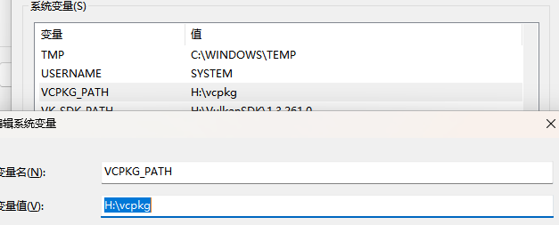

# Renderer

## 项目介绍

Renderer 是一个简易的渲染器

## 功能特点

- 灵活的 API 设计，易于集成到其他项目中。

## 安装指南

```bash
git clone https://github.com/yourusername/Renderer.git
cd Renderer
git submodule update --init
```

## 安装依赖

Renderer 依赖于以下库：OpenGL, GLEW, GLFW3, SDL2, Eigen3, Assimp 和 Vulkan。你可以通过以下 vcpkg 命令来安装这些依赖：

```bash
vcpkg install glew glfw3 sdl2 assimp vulkan
```

## 构建项目

1. CMake Build

    在项目根目录下创建一个构建目录，并进入该目录：


    ```bash
    mkdir build && cd build
    ```

    然后，运行 CMake 来配置项目并构建：


    ```bash
    cmake .. -DCMAKE_TOOLCHAIN_FILE=[vcpkg root]/scripts/buildsystems/vcpkg.cmake
    cmake --build .
    ```

2. Visual Studio 或 Visual Studio Code

    在环境变量中添加`VCPKG_PATH`

    
    
    Visual Studio Code相比Visual Studio需要额外安装CMakeTools插件

## 使用方法

编译完成后，在`executable`目录下会生成可执行文件。运行可执行文件即可启动 Renderer。
